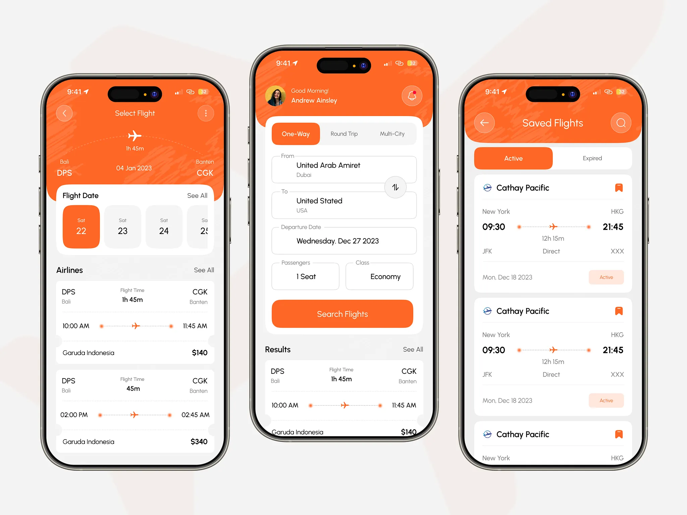

# API-SNCF - Horaires des trains en direct

[](https://app.netlify.com/projects/telma-train/deploys)

A React-based web application for viewing real-time train schedules and information from the SNCF (French National Railway Company) API. This application provides an intuitive interface to explore train stations, departures, arrivals, journeys, and various other SNCF API endpoints.


## Design inspiration

[Sky Trip - Flight Booking App](https://dribbble.com/shots/26215027-Sky-Trip-Flight-Booking-App)
by Afzal Masud 🔥 for Kitify Studio



## 🌐 Live Demo

Visit the live application: [https://ludoo0d0a.github.io/telma/](https://ludoo0d0a.github.io/telma/)

## ✨ Features

- **Real-time Train Information**: View departures and arrivals for any train station
- **Journey Planning**: Search for journeys between different locations
- **Station Explorer**: Browse train stations by city with detailed information
- **Commercial Modes**: Explore different transportation modes available
- **Coverage Areas**: View coverage information for different regions
- **Places Search**: Find train stations and places
- **Lines Information**: View train line details
- **Isochrones**: Visualize travel time zones from specific locations
- **Reports**: Access detailed train reports
- **Interactive API Documentation**: Built-in Swagger UI for API exploration
- **Special Routes**: Dedicated pages for specific routes (Metz-Bettembourg, Metz-Thionville)

## 🛠️ Technologies

- **React** 18.2.0
- **React Router DOM** 6.4.4
- **Axios** for API calls
- **SCSS/Sass** for styling
- **Bulma** CSS framework
- **Swagger UI React** for API documentation
- **React Lottie Player** for animations
- **React Snowfall** for seasonal effects

## 📋 Prerequisites

- Node.js (v14 or higher recommended)
- npm or yarn
- SNCF API key ([Get one here](https://www.sncf-connect.com/partenaire))

## 🚀 Installation

1. Clone the repository:
```bash
git clone https://github.com/ludoo0d0a/telma.git
cd api-sncf
```

2. Install dependencies:
```bash
npm install
```

3. Create a `.env` file in the root directory:
```bash
touch .env
```

4. Add your SNCF API key to the `.env` file:
```env
VITE_API_KEY=your_api_key_here
```

**Note**: The API key should be prefixed with your authentication method. For example:
```env
VITE_API_KEY=Basic your_base64_encoded_credentials
```
or
```env
VITE_API_KEY=Bearer your_token
```

## 🎯 Usage

### Development

Start the development server:
```bash
npm start
```

The application will open at `http://localhost:3000`

### Build

Create a production build:
```bash
npm run build
```

### Deploy

Deployment to GitHub Pages is automated. Every push to the `main` branch will trigger a new deployment.

#### Netlify Deployment

Netlify deployment is automated via GitHub Actions. To set it up:

1. Create a Netlify account and create a new site
2. **Disable Netlify's automatic builds** (since we're using GitHub Actions):
   - Go to your site settings in Netlify
   - Navigate to **Build & deploy > Continuous Deployment**
   - Click **Stop auto publishing** or disable the build hook
   - This ensures only GitHub Actions controls deployments
3. Get your Netlify Auth Token:
   - Go to [Netlify User Settings > Applications > New access token](https://app.netlify.com/user/applications)
   - Create a new access token
4. Get your Site ID:
   - Go to your site settings in Netlify
   - Under "Site details", copy the Site ID
5. Add the following secrets to your GitHub repository:
   - `NETLIFY_AUTH_TOKEN`: Your Netlify access token
   - `NETLIFY_SITE_ID`: Your Netlify site ID

The workflow will automatically:
- Deploy to production on pushes to `main`
- Create preview deployments for pull requests

Deploy to Vercel:
```bash
npm run vercel-build
```

## 📁 Project Structure

```
api-sncf/
├── public/              # Static assets and OpenAPI specification
│   ├── favicons/       # PWA favicons and icons
│   ├── images/         # Station images
│   └── openapi.json    # API documentation
├── scripts/            # Build and utility scripts
│   └── generate-favicons.js  # Favicon generation script
├── src/
│   ├── components/     # Reusable React components
│   │   ├── Arrivals.jsx
│   │   ├── CityCard.jsx
│   │   ├── Departures.jsx
│   │   ├── Header.jsx
│   │   ├── Footer.jsx
│   │   └── TrainStation.jsx
│   ├── pages/          # Page components
│   │   ├── Home.jsx
│   │   ├── City.jsx
│   │   ├── Journeys.jsx
│   │   ├── Schedules.jsx
│   │   └── SwaggerUI.jsx
│   ├── services/       # API service layer
│   │   └── sncfApi.js  # SNCF API wrapper functions
│   └── styles/         # SCSS stylesheets
└── package.json
```

## 🎨 Favicons

The project includes a comprehensive set of PWA favicons and icons located in `public/favicons/`. All favicon references in the application point to the `/favicons/` directory.

### Generating Favicons

To regenerate PWA icons from source files, use the provided npm script:

```bash
npm run generate-favicons
```

This script generates the following icons from source files:
- `pwa-192x192.png` - PWA icon (192x192)
- `pwa-512x512.png` - PWA icon (512x512)
- `pwa-maskable-512x512.png` - PWA maskable icon with safe zone (512x512)
- `favicon-196.png` - Standard favicon (196x196)

The script uses the source icons (`android-chrome-192.png` and `android-chrome-512.png`) to generate all required PWA icons.

### Favicon Sources

The original favicons were created using the [Random Favicon Generator](https://toolcool.org/random-favicon-generator/) tool:

- [Arrow Right Circle Icon](https://toolcool.org/random-favicon-generator/?icon=arrow-right-circle&category=Arrows&stroke-width=2.21&stroke-color=27-61-147-1&has-stroke=true&fill-color=80-111-113-1&has-fill=false&bg-color=117-227-184-1&bg-type=3&rotation=0.00&scale=1.02&sharpness=0.00&smoothness=1.00)
- [Hexagons Icon](https://toolcool.org/random-favicon-generator/?icon=hexagons&category=Shapes&stroke-width=2.21&stroke-color=27-61-147-1&has-stroke=true&fill-color=80-111-113-1&has-fill=false&bg-color=117-227-184-1&bg-type=3&rotation=0.00&scale=1.02&sharpness=0.00&smoothness=1.00)

The tool provides over 1950 MIT-licensed, free Tabler icons that can be customized with colors, stroke width, and other styling properties.

## 🔑 API Configuration

This application uses the SNCF Connect API (formerly known as SNCF Open Data API). All API calls are made to:
- Base URL: `https://api.sncf.com/v1`
- Default Coverage: `sncf`

The API key must be provided in the `Authorization` header for all requests.

## 🛣️ Available Routes

- `/` - Home page
- `/commercial-modes` - Commercial modes overview
- `/journeys` - Journey planning
- `/coverage` - Coverage areas
- `/places` - Places search (Lieux in French)
- `/schedules` - Schedule information
- `/reports` - Train reports
- `/lines` - Train lines
- `/isochrones` - Isochrone visualization
- `/api-docs` - Interactive API documentation (Swagger UI)
- `/metz-bettembourg` - Metz to Bettembourg route
- `/metz-thionville` - Metz to Thionville route
- `/:city` - City-specific station listings
- `/:city/:codeStation` - Individual station details with departures/arrivals

## 🤝 Contributing

Contributions are welcome! Please feel free to submit a Pull Request.

## 📝 License

This project appears to be open source. Please check the repository for specific license information.

## 🙏 Acknowledgments

- [SNCF Connect API](https://www.sncf-connect.com/) for providing the train data
- All contributors and users of this project
